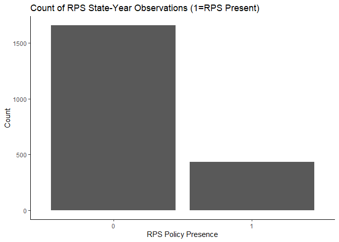
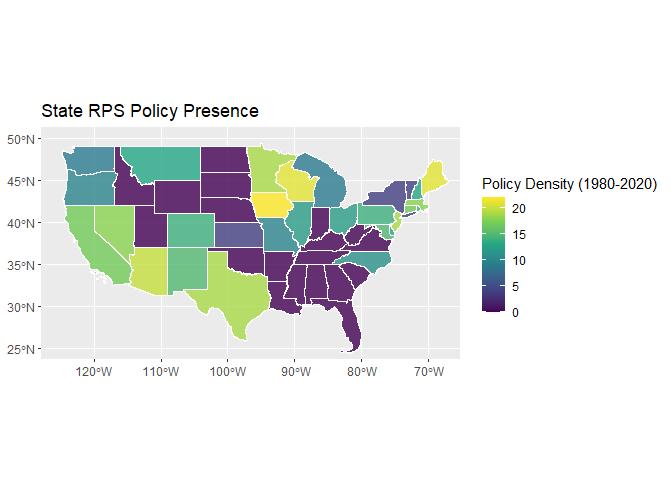
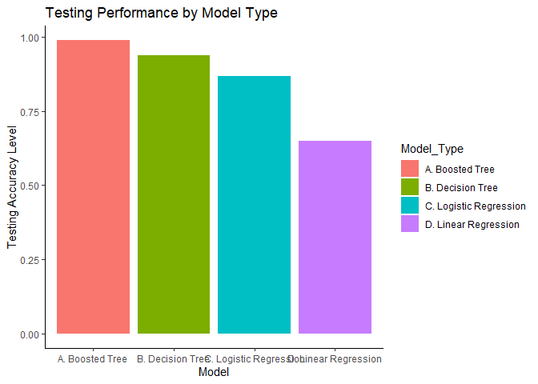
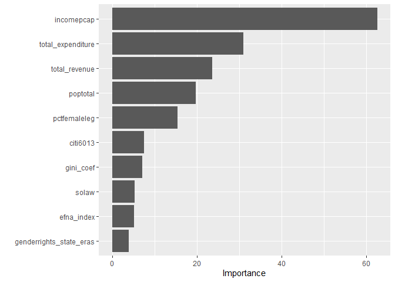

Predicting Renewables Portfolio Standards (RPS)
================
Connor Burton

### 0.1 Summary:

This project utilizes U.S. state political, demographic, and economic
data to predict the presence of green policies in state legislatures. I
utilize data from Berkeley Labs and Michigan State University to train
four machine learning models to predict the presence of Renewables
Portfolio Standards—a minimum percentage of green energy production to
enter the energy mix of a given state. Results of this study indicate
that non-linear models best predict the presence of these green
policies. This summary will proceed with motivating the research
question, a discussion of data and cleaning methods, a look at the
research methodology, and a summary of the results of the project.

### 0.2 Research Motivation:

This project centers on the predicting the presence of Renewables
Portfolio Standards in state governments. Renewables Portfolio Standards
(RPS) are policies designed to encourage electricity providers to
generate energy from some defined minimum of renewable practices such as
wind and solar energy. As of March 2020, no national RPS policy has yet
been implemented, although a majority of states have instituted a range
of policies that fall under this category. It follows that the
institution of these policies may be a function of state political
factors, such as the composition of state congress, key state
industries, and variables that correlate with a taste for environmental
protection, such as GDP per capita and the state’s Gini coefficient of
inequality. Deriving a sound model of how this predictor space
influences policy adoption can provide insights into what economic and
political variables may lead more states to implement these policies,
thus generating investment in renewable energy production and spurring
U.S. energy independence.

### 0.3 Data:

Data for this project comes from both Berkeley Lab’s Electricity Markets
and Policy (EMP) and from the Institute for Public Policy and Social
Research College of Social Science (IPPSR) at Michigan State University.
From Berkely Lab, panel data on RPS compliance by state by year is
utilized for the outcome variable. This data measured RPS obligations in
MWh energy production against actual MWh energy production in a given
state in a given year. Extraneous aspects of this data are simplified
and data on yearly compliance is abstracted into a binary indicator of
where and when RPS policies were implemented to form the outcome space.
Data from IPPSR included approximately 70 economic and political
variables measured by state over time such as population, Gini
coefficient, House & Senate composition, and various voter sentiments.
The primary shortcoming of this data is the need for imputation— linear
and logistic regressions will not run on raw data due to the propensity
of NA values present in this data set -—here, KNN imputation is utilized
in Tidymodels to account for the missing data. All data is constrained
to the years 1980-2020. The motivation for this decision is that the
first RPS policy was implemented in 1983 in Iowa. The start date is
chosen on the basis that predictor variables in the lead-up to the first
policy may have been a key factor in its formulation—the same reasoning
follows other policies, with a longer lead-time given that they were
largely implemented in the 2000s. On a related note, predictor variables
have significantly more missing values as the time horizon extends
backward, thus a limit was imposed.

### 0.4 Method:

This project utilizes linear and logistic regression, as well decision
tree and boosted tree models to predict the presence of RPS policies by
state by year. Each model is implemented using the Tidymodels galaxy of
packages in RStudio and estimated using 5-fold cross validation on a
training set of data (80%). While linear and logistic regression require
no tuning of hyper parameters, the tree methods require a fine-tuned
approach to model selection. For the decision tree, cost complexity and
tree depth are tuned using cross validation; for the boosted tree model,
300 trees are used while tree depth, learn rate, minimum split
observations, and the number of variables to split on are tuned using
cross validation.

### 0.5 Results and Conclusions:

Because the general goal is to determine whether political factors could
accurately predict the presence of RPS policies, accuracy is utilized in
all methods to measure model performance. Mean absolute error is
utilized for selecting the linear regression and accuracy is then
measured separately. In keeping with the notion that the predictor space
has a nonlinear relationship with the outcome, the linear regression
performs worst, while logistic regression improves the accuracy
significantly. Tree methods achieve the highest accuracy, with boosted
trees highly outperforming all other models. Variable importance tends
to center on income per capita, as well as measures of state revenue and
population, implying significant non-causal evidence for the
Environmental Kuznets Curve wherein populations develop a taste for
cleaner environments as a function of their GDP per capita and the level
of pollution in their environment.

Limitations to this prediction project include a limited set of
predictors: only 38 variables were utilized to predict RPS policy
presence. It is likely that a larger and more diverse predictor space
would benefit all models. Similarly, KNN imputation hampers the linear
regression model, which emphasizes the importance of what method is used
to deal with missing data in linear models. It bears mentioning that
IPPSR publishes a \~2300-variable data set with a similar public policy
orientation which can be used in further research with more
computational power. This analysis implies that real-world outcomes may
have highly non-linear determinants, a concept that can be difficult to
internalize from an economics perspective given the rigorous attention
paid to linear regression in this profession

## 1. Data Input and Visualization

``` r
#Loading packages 
library(pacman)
p_load(tidyverse, tidymodels, ranger, modeldata, rlang, magrittr, glmnet, 
       parsnip, data.table, here, rpart.plot, vip, baguette, ranger, xgboost, sf, tigris)

df <- read.csv("rps_df.csv")
df <- df[-c(1,3)]
df$i_rps <- df$i_rps %>% as.factor()
names(df)[2] = 'state'

#Visualizing RPS State-Year Propensity
ggplot(df) +
  geom_bar(aes(x=i_rps)) + 
  labs(title = "Count of RPS State-Year Observations (1=RPS Present)", 
       y = "Count",
       x = "RPS Policy Presence") +
  theme_classic()
```

<!-- -->

This graph depicts the presence of RPS policies in all fifty states for
the years of 1980 to 2020. The vast majority of state-year observations
do not contain RPS policies, providing a null classifier of about 79%
accuracy.

### Policy Presence by State

``` r
#Downloading U.S. shapefile
shape = states(resolution = "500k")
```

    ## Retrieving data for the year 2020

    ##   |                                                                              |                                                                      |   0%  |                                                                              |                                                                      |   1%  |                                                                              |=                                                                     |   1%  |                                                                              |=                                                                     |   2%  |                                                                              |==                                                                    |   2%  |                                                                              |==                                                                    |   3%  |                                                                              |==                                                                    |   4%  |                                                                              |===                                                                   |   4%  |                                                                              |===                                                                   |   5%  |                                                                              |====                                                                  |   5%  |                                                                              |====                                                                  |   6%  |                                                                              |=====                                                                 |   6%  |                                                                              |=====                                                                 |   7%  |                                                                              |=====                                                                 |   8%  |                                                                              |======                                                                |   8%  |                                                                              |======                                                                |   9%  |                                                                              |=======                                                               |   9%  |                                                                              |=======                                                               |  10%  |                                                                              |=======                                                               |  11%  |                                                                              |========                                                              |  11%  |                                                                              |========                                                              |  12%  |                                                                              |=========                                                             |  12%  |                                                                              |=========                                                             |  13%  |                                                                              |==========                                                            |  14%  |                                                                              |==========                                                            |  15%  |                                                                              |===========                                                           |  15%  |                                                                              |===========                                                           |  16%  |                                                                              |============                                                          |  17%  |                                                                              |============                                                          |  18%  |                                                                              |=============                                                         |  18%  |                                                                              |=============                                                         |  19%  |                                                                              |==============                                                        |  19%  |                                                                              |==============                                                        |  20%  |                                                                              |==============                                                        |  21%  |                                                                              |===============                                                       |  21%  |                                                                              |===============                                                       |  22%  |                                                                              |================                                                      |  22%  |                                                                              |================                                                      |  23%  |                                                                              |=================                                                     |  24%  |                                                                              |=================                                                     |  25%  |                                                                              |==================                                                    |  25%  |                                                                              |==================                                                    |  26%  |                                                                              |===================                                                   |  27%  |                                                                              |===================                                                   |  28%  |                                                                              |====================                                                  |  28%  |                                                                              |====================                                                  |  29%  |                                                                              |=====================                                                 |  30%  |                                                                              |=====================                                                 |  31%  |                                                                              |======================                                                |  31%  |                                                                              |======================                                                |  32%  |                                                                              |=======================                                               |  32%  |                                                                              |=======================                                               |  33%  |                                                                              |=======================                                               |  34%  |                                                                              |========================                                              |  34%  |                                                                              |========================                                              |  35%  |                                                                              |=========================                                             |  35%  |                                                                              |=========================                                             |  36%  |                                                                              |==========================                                            |  37%  |                                                                              |==========================                                            |  38%  |                                                                              |===========================                                           |  38%  |                                                                              |===========================                                           |  39%  |                                                                              |============================                                          |  39%  |                                                                              |============================                                          |  40%  |                                                                              |============================                                          |  41%  |                                                                              |=============================                                         |  41%  |                                                                              |=============================                                         |  42%  |                                                                              |==============================                                        |  42%  |                                                                              |==============================                                        |  43%  |                                                                              |==============================                                        |  44%  |                                                                              |===============================                                       |  44%  |                                                                              |===============================                                       |  45%  |                                                                              |================================                                      |  45%  |                                                                              |================================                                      |  46%  |                                                                              |=================================                                     |  47%  |                                                                              |=================================                                     |  48%  |                                                                              |==================================                                    |  48%  |                                                                              |==================================                                    |  49%  |                                                                              |===================================                                   |  49%  |                                                                              |===================================                                   |  50%  |                                                                              |====================================                                  |  51%  |                                                                              |====================================                                  |  52%  |                                                                              |=====================================                                 |  52%  |                                                                              |=====================================                                 |  53%  |                                                                              |======================================                                |  54%  |                                                                              |======================================                                |  55%  |                                                                              |=======================================                               |  55%  |                                                                              |=======================================                               |  56%  |                                                                              |========================================                              |  57%  |                                                                              |========================================                              |  58%  |                                                                              |=========================================                             |  58%  |                                                                              |=========================================                             |  59%  |                                                                              |==========================================                            |  59%  |                                                                              |==========================================                            |  60%  |                                                                              |===========================================                           |  61%  |                                                                              |===========================================                           |  62%  |                                                                              |============================================                          |  62%  |                                                                              |============================================                          |  63%  |                                                                              |=============================================                         |  64%  |                                                                              |=============================================                         |  65%  |                                                                              |==============================================                        |  65%  |                                                                              |==============================================                        |  66%  |                                                                              |===============================================                       |  67%  |                                                                              |===============================================                       |  68%  |                                                                              |================================================                      |  68%  |                                                                              |================================================                      |  69%  |                                                                              |=================================================                     |  70%  |                                                                              |==================================================                    |  71%  |                                                                              |==================================================                    |  72%  |                                                                              |===================================================                   |  72%  |                                                                              |===================================================                   |  73%  |                                                                              |===================================================                   |  74%  |                                                                              |====================================================                  |  74%  |                                                                              |====================================================                  |  75%  |                                                                              |=====================================================                 |  75%  |                                                                              |=====================================================                 |  76%  |                                                                              |======================================================                |  76%  |                                                                              |======================================================                |  77%  |                                                                              |======================================================                |  78%  |                                                                              |=======================================================               |  78%  |                                                                              |=======================================================               |  79%  |                                                                              |========================================================              |  80%  |                                                                              |========================================================              |  81%  |                                                                              |=========================================================             |  81%  |                                                                              |=========================================================             |  82%  |                                                                              |==========================================================            |  82%  |                                                                              |==========================================================            |  83%  |                                                                              |===========================================================           |  84%  |                                                                              |===========================================================           |  85%  |                                                                              |============================================================          |  85%  |                                                                              |============================================================          |  86%  |                                                                              |=============================================================         |  87%  |                                                                              |=============================================================         |  88%  |                                                                              |==============================================================        |  88%  |                                                                              |==============================================================        |  89%  |                                                                              |===============================================================       |  90%  |                                                                              |===============================================================       |  91%  |                                                                              |================================================================      |  91%  |                                                                              |================================================================      |  92%  |                                                                              |=================================================================     |  92%  |                                                                              |=================================================================     |  93%  |                                                                              |==================================================================    |  94%  |                                                                              |==================================================================    |  95%  |                                                                              |===================================================================   |  95%  |                                                                              |===================================================================   |  96%  |                                                                              |====================================================================  |  97%  |                                                                              |====================================================================  |  98%  |                                                                              |===================================================================== |  98%  |                                                                              |===================================================================== |  99%  |                                                                              |======================================================================|  99%  |                                                                              |======================================================================| 100%

``` r
#Combining summarized RPS data with shapefile
df2 = df
df2$i_rps = df2$i_rps %>% as.numeric()
df2['i_rps'][df2['i_rps'] == 1] <- 0
df2['i_rps'][df2['i_rps'] == 2] <- 1
df2 = as.data.table(df2)
df2 = df2[, sum(i_rps), by = 'state']

shape = shape %>% filter(NAME %in% df2$state)
names(shape)[7] = 'state'

map_df = left_join(shape, df2, by = "state")

#Displaying policy presence density by state
ggplot(map_df) + 
  geom_sf(aes(fill = V1), alpha = 0.8, col = "white") +
  coord_sf(xlim = c(-125,-68), ylim = c(25, 50)) +
    scale_fill_viridis_c(name = "Policy Density (1980-2020)") +
    ggtitle("State RPS Policy Presence")
```

<!-- -->

## 2. Data Cleaning:

``` r
#Work here is commented out because file re-writes were part of the cleaning process

##Cleaning IPPSR Data
#test <- read.csv("rps-compliance.csv")
#names(test)[27:48] <- 1999:2020
#names(test)[8:26] <- 1980:1998
#test[8:26]<- 0
#test <- test %>% filter(Total.RPS.or.Tier == "Total RPS")
#test <- test[-(2:7)]
#test <- test[-43]
#test[test=='-'] <- 0
#names(test)[1] <- 'state'
#test[21:42][test[21:42]!= 0] <- 1
#test <- test[-c(19:31), ]

#Converting to time series panel:
#check<- melt(test, id.vars=c("state"))
#check <- check[order(check$state), ]

#Writing to new CSV and loading/ditching index
#write.csv(check, "RPS_ind.csv")
#rps <- read.csv("RPS_ind.csv")
#rps <- rps[-1]
#names(rps)[2:3] <- c("year", "i_rps")

#Loading IPPSR Data and Cleaning
#core <- read.csv("core_vars.csv")
#core <- core %>% filter(year>1979)

#Joining outcome and predictor datasets
#df_1<- left_join(core, rps, by=c("state", "year"))
#df_1$i_rps[is.na(df_1$i_rps)] <- 0
#df_1$i_rps <- df_1$i_rps %>% as.factor()
#write.csv(df_1, "rps_df.csv")
```

## 3. Model Tuning

Here, 80% of the data is split into a training partition while 20% is
left for testing model performance after cross validation.

``` r
##Partitioning Data and Setting Randomization Seed
set.seed(951722690)

#Coding up a Numeric outcome for regression models
df$i_rps2 <- df$i_rps %>% as.integer() %>% as.numeric()
df['i_rps2'][df['i_rps2'] == 1] <- 0
df['i_rps2'][df['i_rps2'] == 2] <- 1
df_train <- sort(sample(nrow(df), nrow(df)*.8))

#Training data 
train<-df[df_train,]
#Testing data 
test<-df[-df_train,]

#Splits for cross validation
df_cv <- train %>% vfold_cv(v = 5)
```

Subsections that follow in Part 3 apply different machine learning
algorithms, recipes, and workflows to the training data subsetted above.
Each model is 5-fold cross validated and every model except the linear
regression (which uses MAE) utilizes accuracy as the success metric.

### 3.1 Tuning Linear Regression

``` r
#Prepping and juicing a cleaned data set with knn imputation
cleaned_df <- recipe(i_rps2 ~ ., data=train) %>% 
  step_rm(year, i_rps) %>%
  step_normalize(all_predictors() & all_numeric()) %>%
  step_impute_knn(all_predictors(), neighbors=5, 
                  impute_with = imp_vars(state))%>% 
  prep() %>% 
  juice()

#Defining how to subset the new cleaned df
df_cv_train <- cleaned_df %>% vfold_cv(v=5)

#Defining recipe
linear_rec <- recipe(i_rps2 ~ ., data=cleaned_df, na.rm=FALSE) %>% 
  step_rm(state) %>%
  step_interact(terms = ~ all_predictors():all_predictors())

#Defining Linear Regression
model_linear<- linear_reg(
  mode = "regression",
  engine = "lm")

#Defining workflow
workflow_linear <-
  workflow() %>% 
  add_model(model_linear) %>% 
  add_recipe(linear_rec)

#CV Linear:
cv_linear <- 
  workflow_linear %>%
  fit_resamples(
      resamples= df_cv_train, 
      metrics = metric_set(mae))
```

### 3.2 Tuning Logistic Regression

``` r
#Defining recipe
cleaned_log<- recipe(i_rps ~ ., data=train) %>% 
  step_rm(year, i_rps2) %>%
  step_normalize(all_predictors() & all_numeric()) %>%
  step_impute_knn(all_predictors(), neighbors=5, 
                  impute_with = imp_vars(state))%>% 
  prep() %>% 
  juice()
cleaned_log$i_rps = as.factor(cleaned_log$i_rps)

#Defining how to subset the new cleaned data
df_cv_train_log <- cleaned_log %>% vfold_cv(v=5)

#Defining recipe
log_rec <- recipe(i_rps ~ ., data=cleaned_log) %>% 
  step_rm(state) # %>%
  #step_interact(terms = ~all_predictors():all_predictors())

#Model: 
model_log<- logistic_reg(
  mode = "classification",
  engine = "glm")

#Defining workflow
workflow_log <-
  workflow() %>% 
  add_model(model_log) %>% 
  add_recipe(log_rec)

#CV Logit
cv_log <-
  workflow_log %>%
    fit_resamples(
      resamples= df_cv_train_log, 
      metrics = metric_set(accuracy))
```

### 3.3 Tuning Decision Tree

``` r
#Defining recipe
rec_tree <- recipe(i_rps ~ ., data=train) %>% 
  step_rm(year, state, i_rps2) %>%
  step_normalize(all_predictors() & all_numeric())

#Defining tree model
model_tree <- decision_tree(
  mode = "classification",
  cost_complexity = tune(),
  tree_depth = tune(),
  min_n = 10) %>%
  set_engine("rpart")

#Defining workflow
tree_workflow <-
  workflow() %>% 
  add_model(model_tree) %>% 
  add_recipe(rec_tree)

#CV Decision tree with tuning
cv_tree <-
  tree_workflow %>%
  tune_grid(
    df_cv,
    grid = expand_grid(
      cost_complexity = seq(0,0.02, by = 0.001),
      tree_depth = c(5,10,20,30)),
    metrics = metric_set(accuracy))
```

### 3.4 Tuning Boosted Tree

``` r
#Defining boosted tree model
model_boosted <- boost_tree(
  mode = "classification",
  mtry = tune(),
  trees= 300,
  min_n = tune(),
  tree_depth = tune(),
  learn_rate = tune()) %>%
  set_engine(engine = "xgboost")

#Defining workflow
boosted_workflow <-
  workflow() %>% 
  add_model(model_boosted) %>% 
  add_recipe(rec_tree)

#CV Decision tree with tuning
cv_boosted <-
  boosted_workflow %>%
  tune_grid(
    df_cv,
    grid = expand_grid(
      mtry = c(4, 6, 8),
      min_n = c(5, 10),
      tree_depth = c(30, 40, 50),
      learn_rate = c(0.1, 0.05, 0.025)),
    metrics = metric_set(accuracy))
```

## 4. Training: Fitting on Trained Data

### 4.1 Null Classifier

``` r
#Null classifier: 
rps_ind <- df$i_rps %>% as.numeric() %>% 
  as.data.frame() %>% 
  mutate(i_rps= ifelse(.>1, 1, 0))
null_cl <- 1 - mean(rps_ind$i_rps)
null_cl
```

    ## [1] 0.792922

The modal case in the set of all state-year observations is the absence
of an RPS Policy, accounting for roughly 79.3% of the data. RPS presence
in a state-year accounts for about 20.7% of the data. The following Part
4 subsections provide accuracy figures for each cross-validated model on
training predictions.

### 4.2 Linear Regression Fit:

``` r
#Finding best model
best_linear_wf <- 
  workflow_linear %>%
  finalize_workflow(select_best(cv_linear, metric='mae')) %>% 
  fit(data=cleaned_df)

#Using best model on cleaned data (imputated)
linear_check<- predict(best_linear_wf, cleaned_df) %>%
  mutate(.pred = ifelse(.pred>0, 1, 0))
linear_out <- cbind(cleaned_df[39], linear_check[1]) 
linear_out$i_rps2 <- linear_out$i_rps2 %>% as.character %>% as.factor()
linear_out$.pred <- linear_out$.pred %>% as.character %>% as.factor()
linear_out %>% accuracy(i_rps2, .pred)
```

    ## # A tibble: 1 x 3
    ##   .metric  .estimator .estimate
    ##   <chr>    <chr>          <dbl>
    ## 1 accuracy binary         0.563

The linear regression model performs worse than the null classifier,
with a training accuracy of \~56%. This is partially a function of the
imputation method utilized and the optimization metric (MAE) differing
from the performance measure (accuracy).

### 4.3 Logistic Regression Fit:

``` r
best_logit<- cv_log %>% show_best() 
best_logit
```

    ## # A tibble: 1 x 6
    ##   .metric  .estimator  mean     n std_err .config             
    ##   <chr>    <chr>      <dbl> <int>   <dbl> <chr>               
    ## 1 accuracy binary     0.923     5 0.00600 Preprocessor1_Model1

The logistic regression model performs significantly better than the
linear model, with a training accuracy of \~92%, although this is only
marginally better than the null classifier.

### 4.4 Tree Fit:

``` r
best_tree <- cv_tree %>% show_best(metric="accuracy") 
best_tree
```

    ## # A tibble: 5 x 8
    ##   cost_complexity tree_depth .metric  .estimator  mean     n std_err .config    
    ##             <dbl>      <dbl> <chr>    <chr>      <dbl> <int>   <dbl> <chr>      
    ## 1           0.008         10 accuracy binary     0.916     5  0.0109 Preprocess~
    ## 2           0.008         20 accuracy binary     0.916     5  0.0109 Preprocess~
    ## 3           0.008         30 accuracy binary     0.916     5  0.0109 Preprocess~
    ## 4           0.006         10 accuracy binary     0.914     5  0.0114 Preprocess~
    ## 5           0.006         20 accuracy binary     0.914     5  0.0114 Preprocess~

The decision tree model performs similarly to the logistic regression
model, with a training accuracy of \~92% in the best model. This may to
suggest that non-linear relationships are at play between political and
economic variables and the presence of Renewables Portfolio Standards
presence.

### 4.5 Boosted Tree Fit:

``` r
best_bt<- cv_boosted %>% show_best(metric= "accuracy") 
best_bt
```

    ## # A tibble: 5 x 10
    ##    mtry min_n tree_depth learn_rate .metric  .estimator  mean     n std_err
    ##   <dbl> <dbl>      <dbl>      <dbl> <chr>    <chr>      <dbl> <int>   <dbl>
    ## 1     8     5         50      0.1   accuracy binary     0.941     5 0.00871
    ## 2     8     5         30      0.1   accuracy binary     0.940     5 0.00723
    ## 3     8     5         40      0.1   accuracy binary     0.940     5 0.00759
    ## 4     8     5         30      0.05  accuracy binary     0.938     5 0.00876
    ## 5     8     5         40      0.025 accuracy binary     0.938     5 0.00982
    ## # ... with 1 more variable: .config <chr>

The boosted tree outperforms all prior models, with a training accuracy
of \~95%. This is further evidence that state political and economic
variables can predict the presence of RPS policies, merely in a less
intuitive and nonlinear way.

## 5. Prediction: Fitting on Testing Data

The following subsections extract the accuracy of each ML model in
predicting the testing data, with accuracy utilized as a performance
metric.

### 5.1.1 Linear Regression:

``` r
#Imputing test data using previous method for gathering linear model test accuracy
test_clean_linear_df <- recipe(i_rps2 ~ ., data=test) %>% 
  step_rm(year, i_rps) %>%
  step_normalize(all_predictors() & all_numeric()) %>%
  step_impute_knn(all_predictors(), neighbors=5, 
                  impute_with = imp_vars(state))%>% 
  prep() %>% 
  juice()

#Running cleaned test data through previously-found model:
test_linear_wf <- 
  workflow_linear %>%
  finalize_workflow(select_best(cv_linear, metric='mae')) %>% 
  fit(data=test_clean_linear_df)

#Predicting new data with trained model
test_linear_acc<- predict(best_linear_wf, test_clean_linear_df) %>%
  mutate(.pred = ifelse(.pred>0, 1, 0))
test_linear_out <- cbind(test_clean_linear_df[39], test_linear_acc[1]) 
test_linear_out$i_rps2 <- test_linear_out$i_rps2 %>% as.character %>% as.factor()
test_linear_out$.pred <- test_linear_out$.pred %>% as.character %>% as.factor()
```

### 5.1.2 Logistic Regression:

``` r
#Running same cleaning algorthm on test data: 
test_clean_log_df <- recipe(i_rps ~ ., data=test) %>% 
  step_rm(year, i_rps2) %>%
  step_normalize(all_predictors() & all_numeric()) %>%
  step_impute_knn(
    all_predictors(), neighbors=5, impute_with = imp_vars(state))%>% 
  prep() %>% 
  juice()

#Running best workflow on new data
test_log_wf <- 
  workflow_log %>%
  finalize_workflow(select_best(cv_log, metric='accuracy')) %>% 
  fit(data=cleaned_log)

#Predicting new data with trained model
test_log_acc<- predict(test_log_wf, test_clean_log_df)
test_log_out <- cbind(test[40], test_log_acc[1]) 
test_log_out$i_rps2 <- test_log_out$i_rps %>% as.character %>% as.factor()
test_log_out$.pred <- test_log_out$.pred %>% as.character %>% as.factor()
```

### 5.1.3 Decision Tree:

``` r
#Running best workflow on new data
test_tree_wf <- 
  tree_workflow %>%
  finalize_workflow(select_best(cv_tree, metric='accuracy')) %>% 
  fit(data=test)

#Predicting new data with trained model
test_tree_acc<- predict(test_tree_wf, test) 
test_tree_out <- cbind(test[40], test_tree_acc[1]) 
test_tree_out$i_rps2 <- test_tree_out$i_rps %>% as.character %>% as.factor()
test_tree_out$.pred <- test_tree_out$.pred %>% as.character %>% as.factor()
```

### 5.1.4 Boosted Tree:

``` r
#Running best workflow on new data
test_boosted_wf <- 
  boosted_workflow %>%
  finalize_workflow(select_best(cv_boosted, metric='accuracy')) %>% 
  fit(data=test)
```

    ## [14:58:04] WARNING: amalgamation/../src/learner.cc:1115: Starting in XGBoost 1.3.0, the default evaluation metric used with the objective 'binary:logistic' was changed from 'error' to 'logloss'. Explicitly set eval_metric if you'd like to restore the old behavior.

``` r
#Predicting new data with trained model
test_boosted_acc<- predict(test_boosted_wf, test) 
test_boosted_out <- cbind(test[40], test_boosted_acc[1]) 
test_boosted_out$i_rps2 <- test_boosted_out$i_rps %>% as.character %>% as.factor()
test_boosted_out$.pred <- test_boosted_out$.pred %>% as.character %>% as.factor()
```

### 5.2.1 Linear Regression Testing Performance:

``` r
#Linear Regression Test Accuracy:
Linear_Regression <- test_linear_out %>% accuracy(i_rps2, .pred)
Linear_Regression
```

    ## # A tibble: 1 x 3
    ##   .metric  .estimator .estimate
    ##   <chr>    <chr>          <dbl>
    ## 1 accuracy binary         0.649

The linear regression model accuracy improved in testing data, with an
accuracy of about 65%. However, this is still below the null classifier
and suffers from imputation methods.

### 5.2.2 Logistic Regression Testing Performance:

``` r
#Logistic Regression Test Accuracy:
Logistic_Regression<- test_log_out %>% accuracy(i_rps, .pred)
Logistic_Regression
```

    ## # A tibble: 1 x 3
    ##   .metric  .estimator .estimate
    ##   <chr>    <chr>          <dbl>
    ## 1 accuracy binary         0.869

The logistic regression model accuracy worsened in testing data, with an
accuracy of about 87%, implying that the model was overfitted on testing
data, or there is otherwise something in the testing data that could not
be trained in the training data through this method.

### 5.2.3 Decision Tree Testing Performance:

``` r
#Decision Tree Test Accuracy:
Decision_Tree<- test_tree_out %>% accuracy(i_rps, .pred)
Decision_Tree
```

    ## # A tibble: 1 x 3
    ##   .metric  .estimator .estimate
    ##   <chr>    <chr>          <dbl>
    ## 1 accuracy binary         0.938

Decision tree accuracy improved to \~94% in testing data, strengthening
the finding that the relationships between the outcome and predictor
space are nonlinear.

### 5.2.4 Boosted Tree Testing Performance:

``` r
#Boosted Tree Test Accuracy:
Boosted_Tree<- test_boosted_out %>% accuracy(i_rps, .pred)
Boosted_Tree
```

    ## # A tibble: 1 x 3
    ##   .metric  .estimator .estimate
    ##   <chr>    <chr>          <dbl>
    ## 1 accuracy binary         0.988

Testing accuracy in the boosted tree model reached the highest point of
any model, at \~99%, implying that this model best explains variation in
the data.

## 6. Summary Figures:

``` r
#Prepping graphic of model performance 
acc_graph <- rbind(
  Linear_Regression, Logistic_Regression, Decision_Tree, Boosted_Tree) %>%
  as.data.frame()
acc_graph_names <- c('D. Linear Regression', 'C. Logistic Regression', 'B. Decision Tree', 'A. Boosted Tree')
acc_graph <- cbind(acc_graph, acc_graph_names)
names(acc_graph)[4] <- 'Model_Type'
```

## 6.1 Visualizing Model Performance

``` r
ggplot(acc_graph) +
  geom_col(aes(y=.estimate, x=Model_Type, fill=Model_Type)) + 
  labs(title = "Testing Performance by Model Type", 
       y = "Testing Accuracy Level",
       x = "Model") +
  theme_classic()
```

<!-- -->

This graph makes it clear that nonlinear models are exceedingly more
capable at explaining variation in the presence of RPS policies. with
testing performance approaching 100% as models increase in
non-linearity.

### 6.2 Variable Importance (Source: Decision Tree)

``` r
tree_var_imp <- test_tree_wf %>% extract_fit_parsnip()
tree_var_imp %>% vip()
```

<!-- -->

The above graph describes which variables were found to be the most
predictive of state RPS policy presence in the decision tree model. The
key variables imply that the presence of RPS policies follows some
non-linear, non-parametric, non-causal version of the Environmental
Kuznets Curve, which states that populations gain a preference for
cleaner air as a result of increasing GDP per capita. While this
relationship is not causal or linear, the key variables do provide
insights into how income per capita can help explain tastes for cleaner
air, and describe how RPS policies may arise in the future.
